## Cat and Dog Classification
For this project, our goal was to find an approach to classifying a collection of images featuring dogs and cats that was better than a currently existing baseline model, an SVM using color histograms for feature selection. 

<!--
Function used to find error rates:
```{r}
err.linear <- function(train.x, train.y, cost, K){
  ix <- sample(1 : length(train.y))
  begin <- 1 + seq(0, K - 1) * round(length(train.y) / K)
  end <- begin + round(length(train.y) / K) - 1
  len <- length(cost)
  err <- rep(0, len)
  for (i in 1 : len){
    for (k in 1 : K){
      test.ix <- ix[begin[k] : end[k]]
      train.ix <- ix[-(begin[k] : end[k])]
      m <- svm(train.x[train.ix, ], train.y[train.ix], type = 'C',
             kernel = 'linear', cost = cost[i],gamma = 0)
      y_hat <- predict(m, train.x[test.ix, ])
      err[i] <- err[i] + sum(y_hat != train.y[test.ix]) / length(train.y[test.ix])
    }
  } 
  err <- err / K
  return(err)
}
```
#### Error Rates
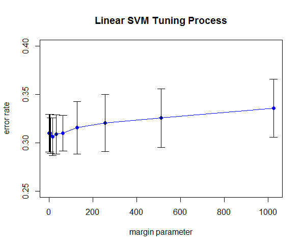

This figure represents the resulting error rates after training and testing. We see that as the margin parameter increases, the error rate of classification increases as well, although not to a significant extent. Nonetheless, we could choose our optimal cost (lambda parameter) to be 25 if we were to continue using an SVM to classify these images.

-->
### Our Pipeline:

<div style = "text-align: center;">
  <span style="float:left;width: 100%;">
  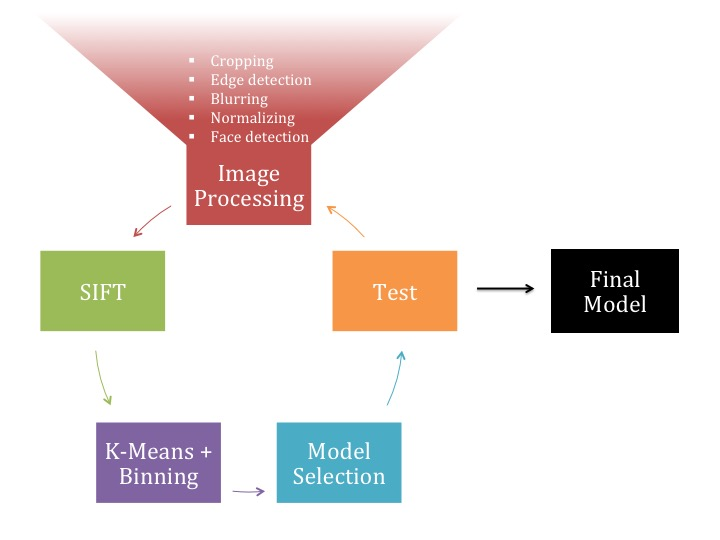
  </span>
</div>

### Image processing

#### Cropped Images
Cropped images were chosen in for several reasons. For one, cropping reduces the computation time for training by decreasing the amount of data that is required to process an image. Second, and one of the most important, in order for us to create our visual vocabulary (codebook), we wanted our model to be very accurate and we knew that the main difference between cats and dogs are their facial features. One drawback from this method, however, was that we also had to limit the number of images we could train from. Also, the image split between cats and dogs was around 23 : 67, which could lead to bias in our results.

#### Haar Cascade Classifiers
Haar cascade classifiers take trained masks (black and white pixels) and use them for pattern recognition within an image. This is the method used in many face-detection programs (Facebook, your camera, etc.) as well as the method used in the infamous Viola-Jones face detection paper. 

<div style = "width: 100%">
  <span style="float: left; width: 50%;">
    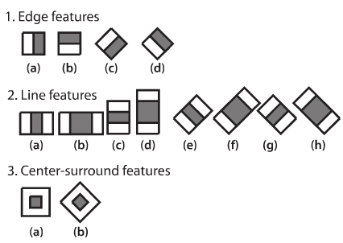
  </span>
  <span style="float: left; width: 50%;">
    
  </span>
  <br style="clear: left;" />
</div>

A Haar cascade classifier was explored in order to automatically detect faces of cats and dogs from a given image (with background). This method would then have been utilized to detect and crop any potential new images, which would have allowed us to extract features only from the face and ignore the rest of the image. 

<div style = "text-align: left;">
  <span style="float:left;width: 40%;">
    <b>Full image</b>
  </span>
  <span style="float:left;width: 20%;">
    <b></b>
  </span>
  <span style="float:right;width: 40%;">
    <b>Boxed image</b>
  </span>
</div>
<br>&nbsp;<br> 
<div style = "width: 100%">
  <span style="float: left; width: 40%;">
    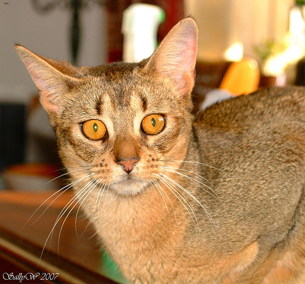
  </span>
  <span style="float: left; width: 20%;">
    
  </span>
  <span style="float: right; width: 40%;">
    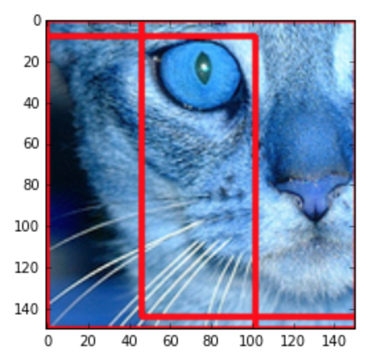
  </span>
  <br style="clear: left;" />
</div>
<br>&nbsp;<br> 
<div style = "width: 100%">
  <span style="float: left; width: 40%;">
    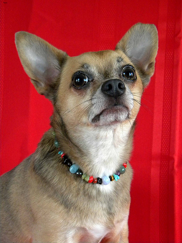
  </span>
  <span style="float: left; width: 20%;">
    
  </span>
  <span style="float: left; width: 40%;">
    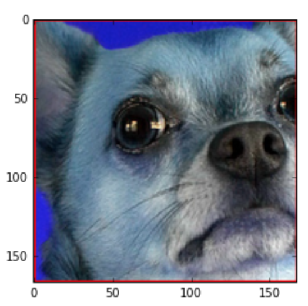
  </span>
  <br style="clear: left;" />
</div>
<br>&nbsp;<br> 
<div style = "width: 100%">
  <span style="float: left; width: 40%;">
    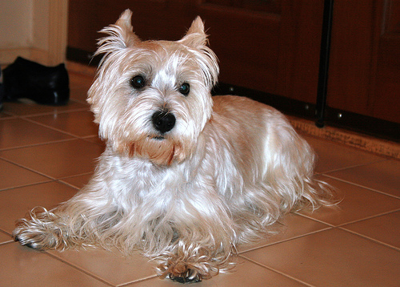
  </span>
  <span style="float: left; width: 20%;">
    
  </span>
  <span style="float: left; width: 40%;">
    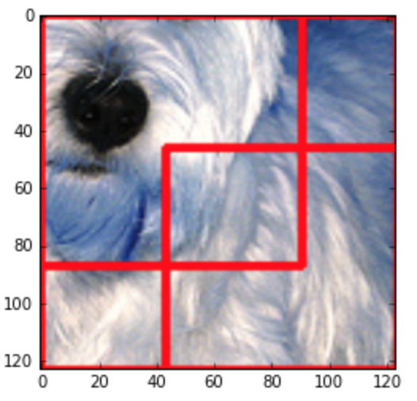
  </span>
  <br style="clear: left;" />
</div>

In the end, we decided not to use a Haar cascade classifier. It worked well with the cat images but for some reason did not pick up on dogs' faces with the same level of accuracy. 

#### Image Blurring and Edge Detection
We investigated image blurring and edge detection in order to remove background noise and simplify images with many objects in them. 

<div style = "text-align: center;">
  <span style="float:left;width: 50%;">
    <b>Grayscale</b>
  </span>
  <span style="float:right;width: 50%;">
    <b>Grayscale + Blur</b>
  </span>
</div>
<div style = "width: 100%">
  <span style="float: left; width: 50%;">
    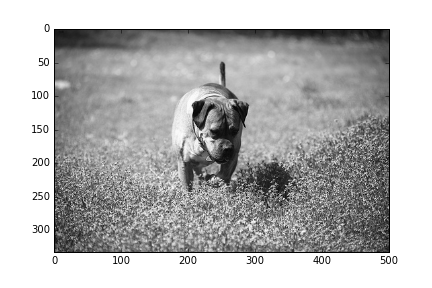
  </span>
  <span style="float: left; width: 50%;">
    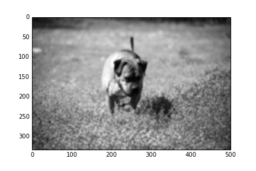
  </span>
  <br style="clear: left;" />
</div>
<div style = "text-align: center;">
  <span style="float:left;width: 50%;">
    <b>Edge detection</b>
  </span>
  <span style="float:right;width: 50%;">
    <b>Edge detection + Blur</b>
  </span>
</div>
<div style = "width: 100%">
  <span style="float: left; width: 50%;">
    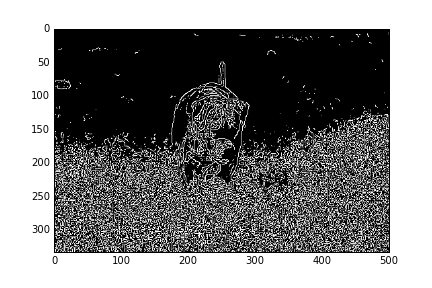
  </span>
  <span style="float: left; width: 50%;">
    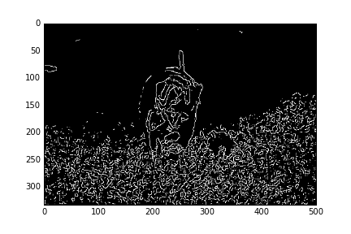
  </span>
  <br style="clear: left;" />
</div>

You can see from these comparisons that after adding the blurring effects, edge detection was still able to pick up much of the area around the face but simplify the details in the rest of the image, especially the grassy area. In the end, we chose to use a combination of blurring and edge detection to improve our method of feature selection, SIFT.

### SIFT
We chose to use scale invariant feature transformation (SIFT) as the feature detector and descriptor for image analysis. 

The key challenge was to find a good balance between accuracy (# of keypoints/visual features) and time efficiency. The more keypoints we chose to keep, the higher the computational cost. But if we didn't keep enough keypoints, they wouldn't sufficiently represent the features we need to detect. 

<div style = "text-align: center;">
  <span style="float:left;width: 50%;">
  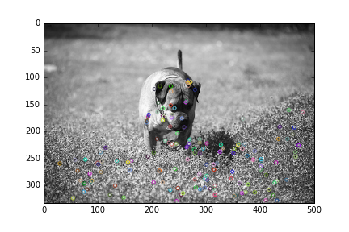
  </span>
  <span style="float:right;width: 50%;">
  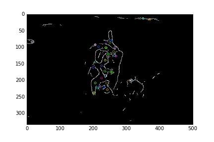
  </span>
</div>
<div style = "text-align: center;">
  <span style="float:left;width: 50%;">
    <b>Sift with no edge detection</b>
  </span>
  <span style="float:right;width: 50%;">
    <b>Sift with edge detection</b>
  </span>
</div>
<br>&nbsp;<br> 

To find the most optimal number of keypoints to work with, we arbitrarily chose the cluster size to be 25 and made a straightforward comparison of various machine learning algorithms and their performance levels between 0 and 400 keypoints. We found that a sufficient number of algorithms hit high points of accuracy at keypoints = 300, and thus chose to use 300 moving forward.

<div style = "text-align: center;">
  <span style="float:left;width: 100%;">
  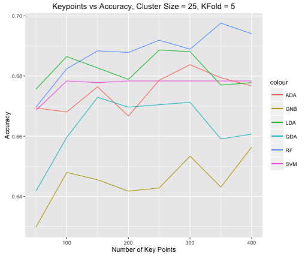
  </span>
</div>
<br>&nbsp;<br>

**Optimal number of keypoints = 300**

### Mini Batch K-Means Clustering + Binning
We wanted to use k-means clustering to produce the visual vocabulary (codebook) because other better-performing clustering algorithms are often too slow and too memory-intensive. K-means sufficiently reduces the space of the data in a relatively fast and robust way.

However, we used a variation of k-means in which we took mini-batches, i.e. MiniBatchKMeans, to reduce computation time but largely maintain similar results. Mini batch k-means samples from the population and finds the centroid from that sample for each iteration. The figure below shows an example of how the algorithm compares to using k-means.

<div style = "text-align: center;">
  <span style="float:left;width: 100%;">
  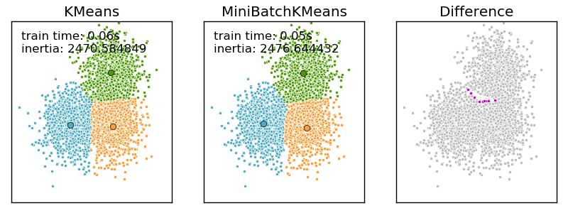
  </span>
</div>
<br>&nbsp;<br>

Setting number of keypoints = 300, we again looked at the optimal number of clusters to use and found that many of the machine learning algorithms reached a performance peak at # of clusters = 150. Note that at number of clusters = 300, the performance of each algorithm generally stabilizes. This is intuitive since after the number of clusters surpasses the number of keypoints, the continued increase of clusters becomes rather trivial. (Note: we are not sure why SVM spiked so high after 200 clusters...)

<div style = "text-align: center;">
  <span style="float:left;width: 100%;">
  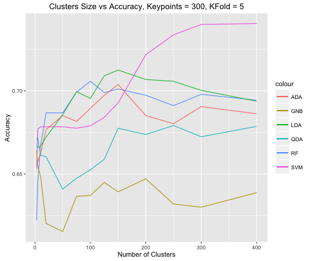
  </span>
</div>
<br>&nbsp;<br>

**Optimal number of clusters = 150**

### Model selection + Testing
The graph below shows the classification accuracy using 5-fold cross validation. We can see that in almost all test cases, random forest (RF) outperformed all other models. 

+ Random forest had an average of 73.25% accuracy
+ AdaBoost had an average of 72.11% accuracy
+ Linear discriminant analysis had an average of 72.06% accuracy

<div style = "text-align: center;">
  <span style="float:left;width: 100%;">
  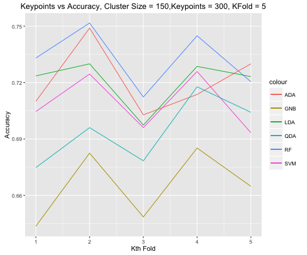
  </span>
</div>
<br>&nbsp;<br>

We chose random forest for several reasons:

1. It had the highest average accuracy
2. We know that random forests reduce the variance of the model which helps us avoid the issues that come with overfitting

We are sacrificing longer training periods for improved model performance compared to the baseline model.

### Final Model

#### Performance improvement
Average accuracy for SVM + color histogram: 67.73%  
* Average accuracy for SVM + SIFT: 72.73%  
Average accuracy for random forest + SIFT: 74.01%  

#### Running cost tradeoff
Average training and testing time for SVM + color histogram: 70.10 seconds  
* Average training and testing time for SVM + SIFT: 20.34 seconds => 3.5x time improvement over the baseline  
Average training and testing time for random forest + SIFT: 254.54 seconds => 3.6x WORSE time cost than the baseline  

### Conclusion & Future Improvements
Our baseline model for this project was a linear SVM using RGB color histograms, which provided us with an error rate of around 31%. From there, we looked at many image processing methods that would improve our feature selection and ultimately settled on using SIFT (scale invariant feature transformation) on black and white, blurred photos with edge detection. In the end, 300 keypoints were chosen for our visual vocabulary of 150 clusters. We proceeded to compare the accuracy rates of six machine learning algorithms on these features using 5-fold cross validation. We found that random forests had the lowest error rate of 26%, but ran much slower than the baseline SVM. Another model using an SVM with features from SIFT, which we've added to the previous performance and running cost analyses (*), had a relatively low error rate as well but ran much faster than the SVM with color histogram. However, we decided to prioritize accuracy over running cost and ultimately chose random forests over the faster SVM + SIFT because of 1) the stability of random forest and 2) due to some of the concerns we had with SVM (see clustering graph). 

#### Time Improvements
+ Producing a Haar cascade classifier which would reduce image dimension
+ PCA or LDA, also for dimension reduction on visual vocabulary 

#### Accuracy Improvements
+ Using Gaussian mixture models (GMM) rather than k-means
+ Normalizing images during processing
+ Producing a more accurage Haar cascade classifier to allow for facial recognition
+ Add color histograms in addition to data
+ Obtain a larger sample of training images that are cropped to faces
